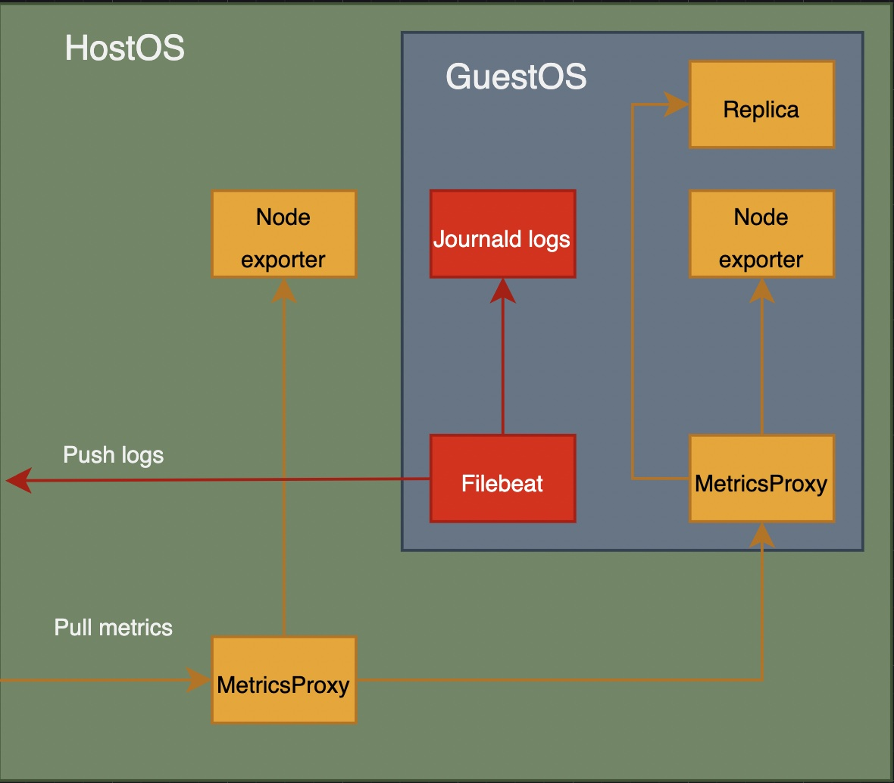
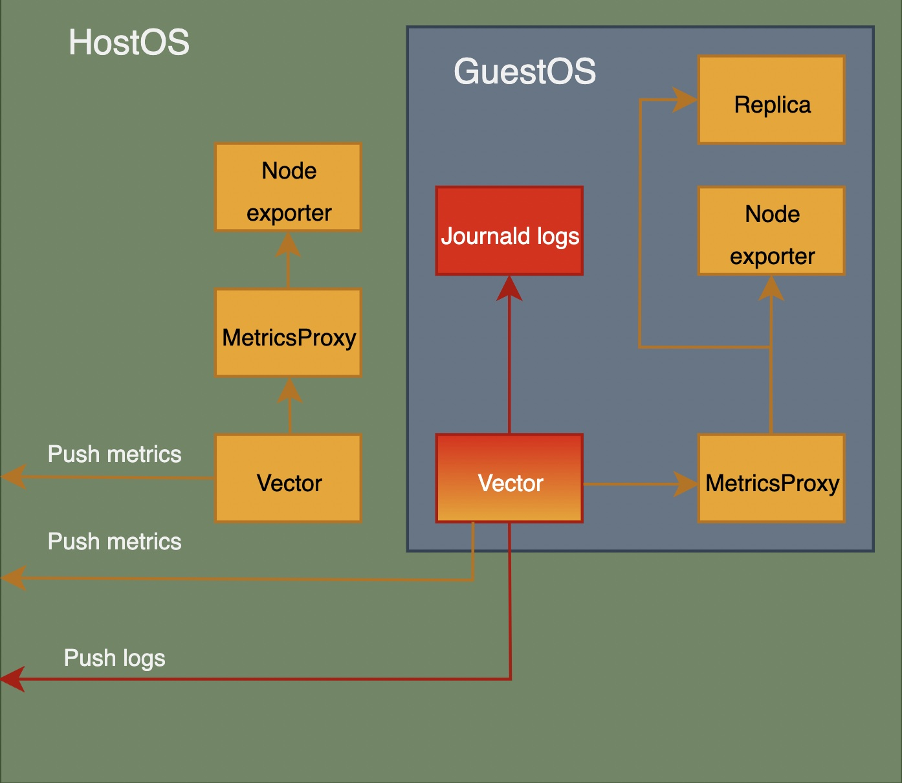

# IC metrics & logs

## Introduction

This project has been propossed to IC to improve the way the metrics and logs are managed within IC nodes. 

The project also, add the chance to IC nodes to push metrics instead of just be pulled, and the chance to configure distinct metrics endpoint where to push. This would allow the IC node providers to receive metrics in their own metrics servers, without the need of reconfigure the IC nodes firewall to allow pull.

### Current architecture

This is the current metrics and logs architecture deployed at IC nodes.

The current architecture is using distinct software for managing logs and metrics at IC nodes. The logs are pushed to external elasticsearch servers using filebeat and the metrics are pulled from known victoria metrics servers that are allowed to do it.  

### Propossed architecture

These are the main goals of this project:
1. Unify the software used to ship metrics and logs to [vector](https://vector.dev/).
1. Allow the chance to push metrics from IC nodes to its provider, in a prometheus exporter format (prometheus or victoriametrics).

