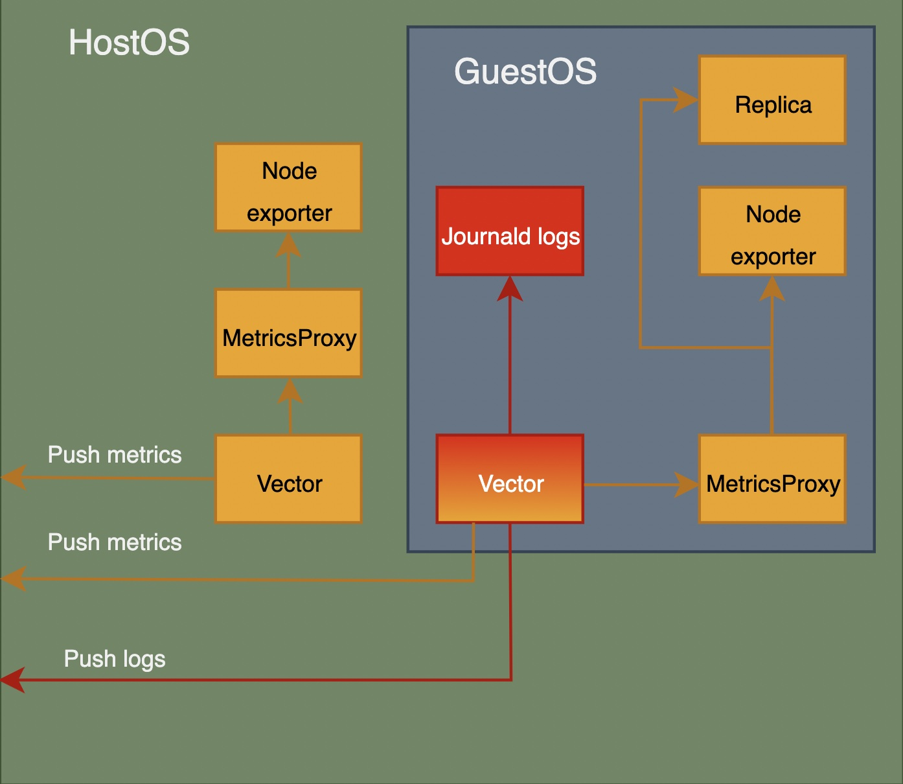

## Vector

[Vector](https://vector.dev/) is a lightweight, ultra-fast tool for building observability pipelines written in Rust. It may collect, transform, and route all your logs and metrics with one simple tool.

### Installation

Vector is a new third party software installed at hostos and guestos to unify the logs and metrics shipping. 

The installation is done in 3 stages at the base docker used for dev and pro envs:

- Download and verify
[hostos/Dockerfile.base#L46C1-L50C28](https://github.com/Zondax/ic/blob/metrics/ic-os/hostos/context/Dockerfile.base#L46C1-L50C28)
[guestos/Dockerfile.base#L44-L48)](https://github.com/Zondax/ic/blob/metrics/ic-os/guestos/context/Dockerfile.base#L44-L48)
```
# Download and verify vector
RUN cd /tmp/ && \
    curl -L -O https://packages.timber.io/vector/0.40.0/vector-0.40.0-x86_64-unknown-linux-gnu.tar.gz && \
    echo "112b047df17df46feb22fc69234e8fc2ad5a411cd2e7d369f3b70c00617a4e90  vector-0.40.0-x86_64-unknown-linux-gnu.tar.gz" > vector.sha256 && \
    shasum -c vector.sha256
```

- Install
[hostos/Dockerfile.base#L122-L126]https://github.com/Zondax/ic/blob/metrics/ic-os/hostos/context/Dockerfile.base#L122-L126
[guestos/Dockerfile.base#L90-L94]https://github.com/Zondax/ic/blob/metrics/ic-os/guestos/context/Dockerfile.base#L90-L94
```

# Install vector
COPY --from=download /tmp/vector-0.40.0-x86_64-unknown-linux-gnu.tar.gz /tmp/vector-0.40.0-x86_64-unknown-linux-gnu.tar.gz
RUN cd /tmp/ && \
    tar --strip-components=3 -C /usr/local/bin/ -zvxf vector-0.40.0-x86_64-unknown-linux-gnu.tar.gz ./vector-x86_64-unknown-linux-gnu/bin/vector && \
    rm /tmp/vector-0.40.0-x86_64-unknown-linux-gnu.tar.gz
```

- User creation
[hostos/Dockerfile#L171-L174](https://github.com/Zondax/ic/blob/metrics/ic-os/hostos/context/Dockerfile#L171-L174)
[hostos/Dockerfile#L213-L216](https://github.com/Zondax/ic/blob/metrics/ic-os/guestos/context/Dockerfile#L213-L216)
```
# The "vector" account. Used to run vector binary to ship logs and metrics of the
RUN useradd --system --create-home -d /var/lib/vector -s /usr/sbin/nologin -c "Vector user" -U -G systemd-journal vector && \
    chown root:root /usr/local/bin/vector
```

### Configuration

The vector configuration has been added to the monitoring components as the ic repo, https://github.com/Zondax/ic/tree/metrics/ic-os/components/monitoring/vector

These are the configuration components:
- Shared: Files are shared for hostos and guestos.
    - [setup-vector-permissions.sh](https://github.com/Zondax/ic/blob/metrics/ic-os/components/monitoring/vector/setup-vector-permissions.sh): Script used to create and secure the vector work folder, `/var/lib/vector`
    - [vector.service](https://github.com/Zondax/ic/blob/metrics/ic-os/components/monitoring/vector/vector.service): Vector hardened service file used to manage the vector service within the os. This file manages the calls to `setup-vector-permissions.sh` and `generate-vector-config.sh`
    - [build-bootstrap-config-image.sh](https://github.com/Zondax/ic/blob/metrics/ic-os/components/hostos-scripts/build-bootstrap-config-image.sh): Integrated the option to generate bootstrap `vector.conf` based on `elasticsearch_hosts` for guestos
    - [Services.adoc](https://github.com/Zondax/ic/blob/metrics/ic-os/docs/Services.adoc): Added vector service info to the docs
- Hostos:
    - [vector.yaml.template](https://github.com/Zondax/ic/blob/metrics/ic-os/components/monitoring/vector/hostos/vector.yaml.template): Template to properly generate vector configuration based on the hostos and guestos metrics proxy sources and configurable sinks where to send hostos and guestos metrics `victoriametric_hosts` variable at `vector.conf`
    - [README.adoc](https://github.com/Zondax/ic/blob/metrics/ic-os/components/monitoring/vector/hostos/README.adoc): Readme file
    - [ic-node.conf](https://github.com/Zondax/ic/blob/metrics/ic-os/components/misc/hostos/ic-node.conf): Secure vector etc folder
    - [generate-vector-config.sh](https://github.com/Zondax/ic/blob/metrics/ic-os/components/monitoring/vector/hostos/generate-vector-config.sh): Script used to generate vector config, based on the type of os and its template
- Guestos:
    - [vector.yaml.template](https://github.com/Zondax/ic/blob/metrics/ic-os/components/monitoring/vector/guestos/vector.yaml.template): Template to properly generate vector configuration based on the guestos metrics proxy, replica, node exporter and journal logs sources, hostos sink and configurable sinks where to send logs `elasticsearch_hosts` variable at `vector.conf`
    - [README.adoc](https://github.com/Zondax/ic/blob/metrics/ic-os/components/monitoring/vector/guestos/README.adoc): Readme file
    - [bootstrap-ic-node.sh](https://github.com/Zondax/ic/blob/metrics/ic-os/components/init/bootstrap-ic-node/guestos/bootstrap-ic-node.sh): Check `vector.conf` bootstrap file to configure vector
    - [ic-node.conf](https://github.com/Zondax/ic/blob/metrics/ic-os/components/misc/guestos/ic-node.conf): Secure vector etc folder
    - [ConfigStore.adoc](https://github.com/Zondax/ic/blob/metrics/ic-os/guestos/docs/ConfigStore.adoc): Added `vector.conf` docs
    - [generate-vector-config.sh](https://github.com/Zondax/ic/blob/metrics/ic-os/components/monitoring/vector/guestos/generate-vector-config.sh): Script used to generate vector config, based on the type of os and its template

### Instances

Once instance of vector has been configured to be running at:
* guestos: It is responsible to:
  * pull guestos metrics from metrics-proxy service, including replica, node-exporter and metrics-proxy metrics.
  * push collected metrics to configurable prometheus remote writer compatible servers instances.
  * pull journald logs.
  * push collected logs to configurable elasticsearch instances.
* hostos: It is responsible to
  * pull hostos metrics from metrics-proxy service, including replica, node-exporter and metrics-proxy metrics.
  * push collected metrics to configurable prometheus remote writer compatible servers instances.

### Data flow

The logs data flow (just running at guestos) is unchanged, but now it is integrated and managed by vector as single tool to manage logs and metrics, replacing filebeat. Vector instance running at guestos is configured to send logs to elasticsearch instances.

The metrics data is also managed by vector but its flow has been updated. There is a new option to push metrics (guestos and hostos) to distinct prometheus remote writer compatible servers, like vistoriametrics. At the same time, the previous data flow may be also configured to maintain backward compatibility, facilitate the potential transition to production environment, allowing the execution of deeper tests, the creation of parallel metrics server, the comparison between flows, etc.

